<p align="center">
  
</p>

```console
$ cat README
segfault-core-dumped — a home for pet projects, weekend experiments
and small tools that scratch a personal itch.

Nothing here is enterprise-grade. Some of it is even finished.
```

### `$ ls -la ~/projects`

<!--
  Add a row per public repo:
  | [`repo-name`](https://github.com/segfault-core-dumped/repo-name) | one-line description | `alpha` / `stable` / `archived` |
-->

| Project | What it does | Status |
| :-- | :-- | :-- |
| *`total 0`* | The first repos are still compiling. | `building…` |

### `$ cat /etc/motd`

```diff
+ Small tools that fix real annoyances
+ Ship early, refactor when it hurts
+ Every crash is a bug report in disguise
- Premature optimization
- Projects that only live in a notes app
```

### `$ which toolbox`

```console
/usr/bin/bash
/usr/bin/python3
/usr/bin/git
/usr/bin/code
/etc/arch-release   # btw
```

### `$ man contributing`

Found a bug? Open an issue. Found a segfault? That's the brand.
Pull requests are welcome in every repo — keep them small and describe *why*, not just *what*.

<p align="center">
  <sub><code>process exited with code 139</code> · made with too much coffee and <code>gdb</code></sub>
</p>
